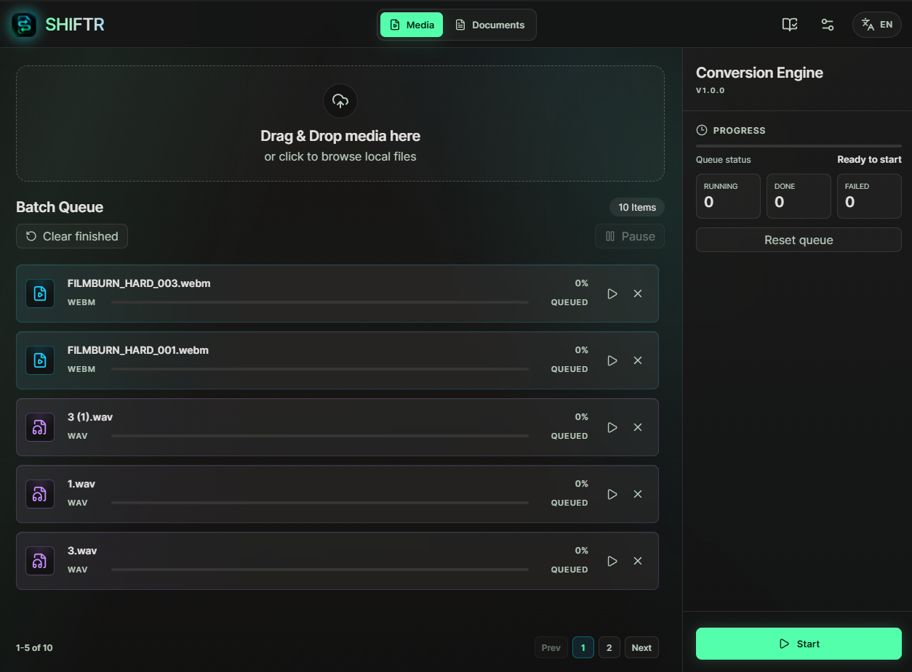
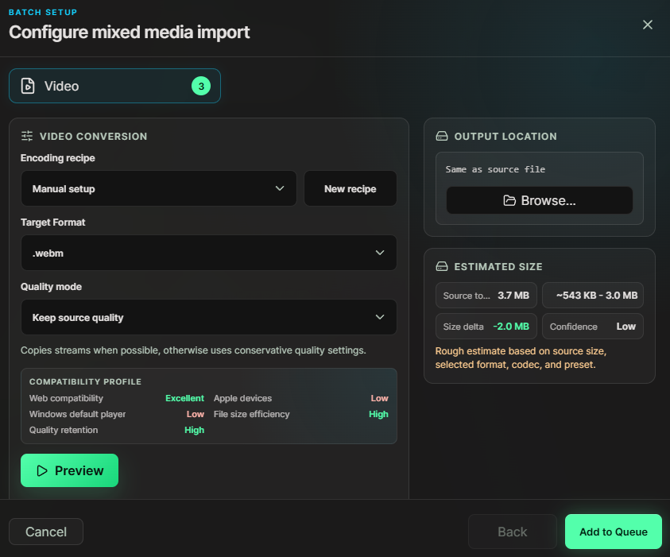

  

<h1 align="center">SHIFTR</h1>

  A modern desktop file converter for media, images, and documents.
  Built for people who want one-click recipes and for users who want full control over codecs, quality, and output settings.

  
  
  
  

---

SHIFTR is a local-first desktop converter built with **Tauri, Rust, React, and TypeScript**. It helps you convert video, audio, images, and basic document workflows without sending files to a cloud service.

The app is designed around a simple idea: conversion tools should not feel like old system utilities from another decade. SHIFTR gives beginners ready-made recipes, while advanced users can choose codecs, frame rate, target size, compatibility tradeoffs, and FFmpeg settings when they need them.

## Screenshots

| Main queue | Batch setup |
| --- | --- |
|  |  |

## Features

- Convert files locally on your device
- Batch conversion for video, audio, and images
- Image tools for `png`, `jpg`, `jpeg`, `webp`, `bmp`, `tiff`, and `ico`
- Video targets including `mp4`, `mkv`, `mov`, `webm`, and `avi`
- Audio targets including `mp3`, `aac`, `m4a`, `ogg`, `opus`, `wav`, and `flac`
- Images to PDF and PDF merge workflows
- Ready-made encoding recipes for common use cases
- Custom recipe import and export
- Adaptive UI for beginners and advanced users
- Advanced codec, quality, frame rate, bitrate, and size target controls
- FFmpeg capability detection, including available codecs and hardware encoders
- Short preview generation before full conversion
- Human-readable errors with technical details available when needed
- Local queue with progress, estimated time, retry, cancel, and output rename

## Built for both kinds of users

**New to conversion?**  
Choose a recipe, pick an output folder, and press Start. SHIFTR handles the technical choices and explains errors in plain language.

**Know what you want?**  
Open advanced options and tune the conversion manually: codec, quality, frame rate, audio bitrate, max width, stream copy, target file size, and more.

SHIFTR has three user levels:

- **Aware** - use ready-made recipes and imported presets
- **Capable** - adjust formats, quality modes, and common encoding options
- **Fluent** - work directly with detailed codec and FFmpeg-related settings

## Why another converter?

Most converters are either too simple or too technical. SHIFTR tries to make the common path fast without hiding the serious controls.

It is built for creators, developers, designers, editors, and anyone who regularly needs to prepare files for websites, social platforms, messaging apps, archives, or personal workflows.

## Powered by

- **Tauri 2** for the desktop app shell
- **Rust** for native conversion, queue, documents, and filesystem work
- **React + TypeScript** for the interface
- **FFmpeg / ffprobe** for video and audio conversion
- Rust image tooling for image conversion
- PDF tooling for document workflows

## FFmpeg

SHIFTR uses FFmpeg for video and audio conversion. Codec support depends on the FFmpeg build used.

The app can use:

- FFmpeg selected in settings
- bundled FFmpeg binaries
- FFmpeg available on the system PATH

Users can replace the FFmpeg path in settings if they prefer their own build.

## Status

SHIFTR is in active development. The current focus is the desktop conversion workflow, UI polish, smart recipes, preview tools, codec detection, and practical batch handling.

If this is the kind of converter you want to see exist, a star helps the project get discovered.

## License

This project is licensed under the [GNU GPL v3.0](LICENSE).

SHIFTR uses third-party open-source tools and libraries, including FFmpeg when configured or bundled.
